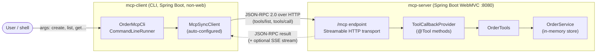

# spring-mcp-ordertools

A [Spring AI](https://docs.spring.io/spring-ai/reference/) project demonstrating the
[Model Context Protocol](https://modelcontextprotocol.io/) end to end:

- **`mcp-server`** — an MCP server exposing order-management tools over the
  **Streamable HTTP** transport (JSON-RPC 2.0 on a single `/mcp` endpoint).
- **`mcp-client`** — a **command-line tool** that connects to the server over
  Streamable HTTP and invokes the tools.

```
spring-mcp-ordertools/        parent (pom packaging, Spring AI BOM)
├── mcp-server/               MCP server — order tools over Streamable HTTP
└── mcp-client/               CLI MCP client
```

## Architecture



Request flow for a single tool call:

```
 ┌──────────┐   args    ┌───────────────┐  JSON-RPC 2.0   ┌────────────────┐
 │  shell   │ ────────► │  OrderMcpCli  │ ──────────────► │  POST /mcp     │
 │ (user)   │           │ McpSyncClient │   tools/call    │ (mcp-server)   │
 └──────────┘           └───────────────┘ ◄────────────── └───────┬────────┘
       ▲                        ▲          JSON-RPC result         │
       │   printed JSON         │                                  ▼
       └────────────────────────┘                         OrderTools → OrderService
```

- **Transport** — MCP Streamable HTTP: a single `/mcp` endpoint speaking JSON-RPC 2.0,
  with an optional SSE upgrade when the server streams multiple messages.
- **Client** — calls `McpSyncClient` directly (no LLM in the loop); it serialises the
  tool name + arguments to a `tools/call` request and prints the returned content.
- **Server** — Spring AI exposes each `@Tool` method via a `ToolCallbackProvider`;
  `OrderTools` delegates to `OrderService`, an in-memory order store.

## Tools

| Tool                | Description                                              |
|---------------------|----------------------------------------------------------|
| `createOrder`       | Create an order for a customer with one or more items.   |
| `getOrder`          | Look up a single order by id.                            |
| `listOrders`        | List orders, optionally filtered by status.              |
| `updateOrderStatus` | Move an order to NEW / PAID / SHIPPED / DELIVERED.       |
| `cancelOrder`       | Cancel an order.                                         |

Orders are held in an in-memory store (`OrderService`) — swap it for a JPA
repository to persist. On startup the store is seeded with **10 sample orders**
(`ORD-1001`–`ORD-1010`), two in each status (`NEW`, `PAID`, `SHIPPED`,
`DELIVERED`, `CANCELLED`), so the tools return useful data immediately. Orders
created at runtime continue from `ORD-1011`.

## Requirements

- Java 21+
- Maven 3.9+

## Build & test

```bash
mvn clean install
```

## Transport: Streamable HTTP (JSON-RPC 2.0)

The server uses the MCP Streamable HTTP transport — every message is JSON-RPC 2.0
over a single endpoint (`POST`/`GET` `/mcp`), with optional SSE upgrade for streamed
server messages. It is enabled in `mcp-server/src/main/resources/application.properties`:

```properties
spring.ai.mcp.server.protocol=STREAMABLE
spring.ai.mcp.server.type=SYNC
```

## Run the server

```bash
mvn -pl mcp-server spring-boot:run
# or
java -jar mcp-server/target/mcp-server-0.0.1-SNAPSHOT.jar
```

Starts on `http://localhost:8080`; the MCP endpoint is `http://localhost:8080/mcp`.

## Run the command-line client

The easiest way is the `order-cli.sh` wrapper. It builds the client jar if needed,
checks the server is reachable (with a friendly hint if it isn't), and pretty-prints
JSON responses when [`jq`](https://jqlang.github.io/jq/) is installed.

With the server running, in another terminal:

```bash
./order-cli.sh help                              # usage (works without the server)
./order-cli.sh tools                             # list available tools
./order-cli.sh create alice SKU-1 Widget 2 9.99  # create an order -> ORD-1001
./order-cli.sh list                              # list all orders
./order-cli.sh list PAID                         # filter by status
./order-cli.sh get ORD-1001                      # fetch one order
./order-cli.sh status ORD-1001 SHIPPED           # update status
./order-cli.sh cancel ORD-1001                   # cancel an order
```

Point at a different server with the `ORDER_MCP_URL` environment variable:

```bash
ORDER_MCP_URL=http://my-host:9000 ./order-cli.sh tools
```

`STATUS` is one of `NEW`, `PAID`, `SHIPPED`, `DELIVERED`, `CANCELLED`.

<details>
<summary>Running the jar directly (without the wrapper)</summary>

```bash
JAR=mcp-client/target/mcp-client-0.0.1-SNAPSHOT.jar
java -jar $JAR tools
java -jar $JAR create alice SKU-1 Widget 2 9.99
```

If the server is down, the client prints a short "cannot reach the MCP server"
message rather than a stack trace.
</details>

The client connects via Streamable HTTP, configured in
`mcp-client/src/main/resources/application.properties`:

```properties
spring.ai.mcp.client.streamable-http.connections.order-server.url=http://localhost:8080
spring.ai.mcp.client.streamable-http.connections.order-server.endpoint=/mcp
```

It uses the auto-configured `McpSyncClient` directly (no LLM in the loop) to
list and call tools.

## Connect from other MCP clients

Any Streamable-HTTP-capable MCP client can point at `http://localhost:8080/mcp`.
For clients that only speak STDIO, swap the server's dependency from
`spring-ai-starter-mcp-server-webmvc` to `spring-ai-starter-mcp-server`, set
`spring.ai.mcp.server.protocol=STDIO`, and have the client launch the jar.

## Project layout

```
mcp-server/
  domain/   Order, OrderItem, OrderStatus  (records + enum)
  service/  OrderService                   (in-memory store + business rules)
  tools/    OrderTools                      (@Tool methods exposed over MCP)
  OrderToolsApplication                     (registers tools as a ToolCallbackProvider)

mcp-client/
  OrderClientApplication                    (non-web Spring Boot app)
  OrderMcpCli                               (ApplicationRunner: parses args, calls McpSyncClient)

order-cli.sh                                (friendly wrapper around the client jar)
```

## Tech stack

- Spring Boot 3.5.15
- Spring AI 1.1.7 (`spring-ai-starter-mcp-server-webmvc`, `spring-ai-starter-mcp-client`)
- MCP Streamable HTTP transport (JSON-RPC 2.0)
